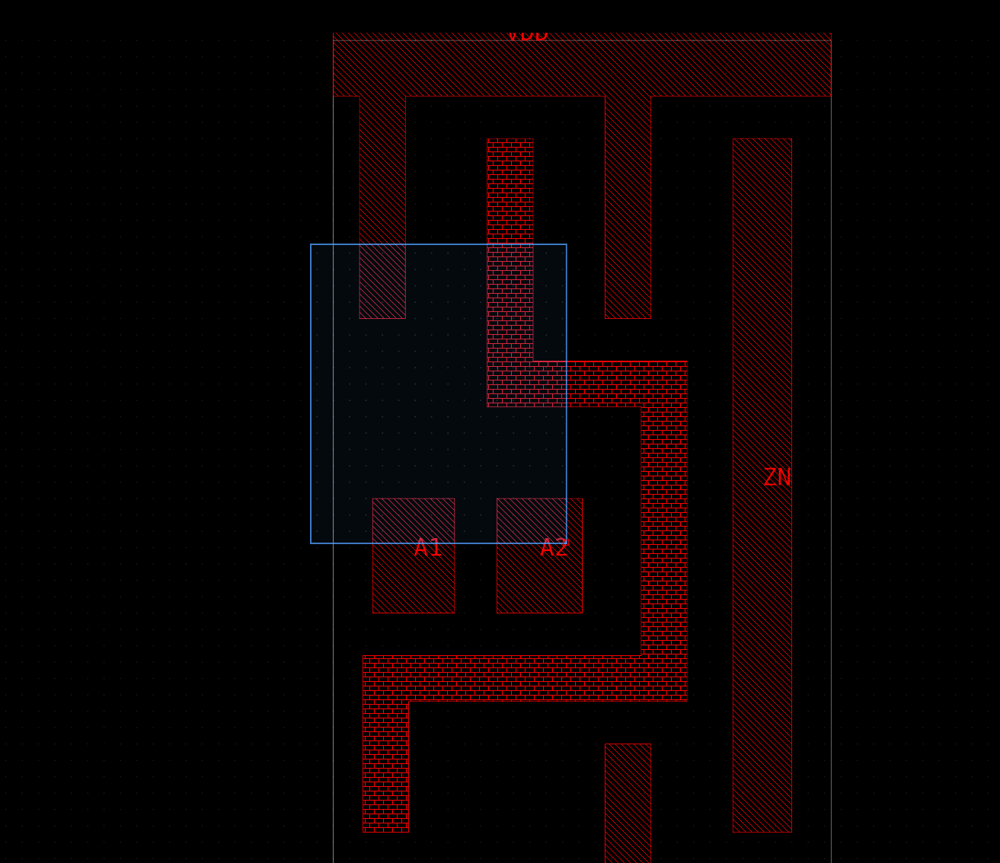

1. Boolean operations on shapes - DONE

I would like a set of TCL commands to perform boolean operations and conversions on shapes.

1.1 COPY - copies the specified shapes from to another layer
1.2 MOVE - moves the specified shapes to another layer
1.3 OR, AND, NOT etc - boolean operations to create new shapes from existing shapes
1.4 TO POLYGON - convert shapes to polygons
1.5 TO RECTS - convert shapes to rects, either vertical or horizontal fracturing (user decides)
1.6 BBOX - returns bbox of the shapes
1.7 SIZE - sizes shapes in X and Y, or both
1.8 PATH - creates a path following the rect boundary or polygon line shapes for a user specified width

All operations take a list of shapes as input (or two lists for boolean operations).

Shapes do not need to be associated with a particular object, unless the user wants them to be written out with write_def. So the database schema needs to be updated for this.

2. Placement moving - DONE

Please add the ability to move a placement. In move mode, when a placement is selected a secondary toolbar should appear under the main toolbar (this is a pattern that will be re-used across different tools). The secondary toolbar will contain:

- Snapping options, either site, finfet grid, manufacturing grid, or no snapping
- Buttons to rotate the placement orientation, horizontal and vertical flips

Site snapping will snap the ghost view to the row's site grid and make sure the orientation matches the rows symmetry.

3. Shape resizing - DONE

Shapes can be resized using a resize tool. A snapping options secondary toolbar will appear with options to:

- Paths - snap center of path to tracks, snap edges to manufacturing grid, snap to user grid, or no snap
- Polygons - snap to user grid, manufacturing grid, finfet grid, or no snap
- Rects - snap to user grid, manufacturing grid, finfet grid, or no snap

- Rectangles can be resized by dragging their edges.
- Polygons segments can be individually moved by dragging their edges.
- Paths segments can be individually moved by dragging anywhere on the segment and the adjacent segment points are moved too.

4. Custom library naming - DONE

Currently, when the user reads LEF, DEF and Verilog a library is created automatically based on the filename. I would like to change this behavour so that a library name is required as a TCL argument.

If a view already exists for the design being read in, then an error should occur but multiple views Abstract, Layout and Schematic can be read into the same design.

If the library name doesn't already exist, then a new library should be created.

5. Flightline display - DONE

Net connections should be drawn between selected placement pins using a light blue line. A separate layer purpose should be used for this, which is invisible by default.

6. Selecting and moving vias - DONE

Vias are not selectable or moveable at the moment, so please add that feature.

7. Regression wrt layer visibility controls - DONE

In a previous bug, the layer selection list contained layers that only have purposes. The layer list should only contain technology layers. Please make sure there is a regression test for this.

8. Objects that not selectable should not have a selectable checkbox. - DONE

9. Settings window - DONE

Please add a setting window in the right side bar to change the following parameters:

9.1. Major and minor grid spacing
9.2. Ruler font size
9.3. Label font size
9.4 Any other settings? Please suggest.

Then move the hierarchy depth and flight line limit into the new settings window.

There should be an option to save the settings into your home dir or a file of the users choosing, using a system file dialog. JSON is the prefered format.

10. Library browser tree should be collapsed by default - DONE

11. Let's just merge placementBoundary and placementName into one purpose called placement - DONE

12. Please allow via arrays to be selectable and moveable - DONE

13. Please update the move tool so it has the same grid snapping options as resize for routes and vias. - DONE

14. Resize tool button should be disabled when placements are selected - DONE

15. Info window - DONE

Please add an info window to the bottom of the right sidebar. This will replace the "tooltip" column in the status_bar.

16. Toolbar cleanup - DONE

Please add a dark gray border to the right of the mode selector and the bottom of the mode toolbar and secondary toolbar. Also reduce the icon sizes in the secondary toolbar to match the height of the buttons.

17. Default layer colors and customization - DONE

Please update the default layer/via colors to use brighter colors, the higher metal layers are too dark. Start with primary colors for the lower layers, then cycle through secondary colors, then tertiary colors etc

Also, when the user clicks on the color swatch, I would like a color picker to appear, which can be saved in the settings.json.

18. Exit dialog

If there are unsaved database mutations (i.e. write_def has not been ran), then when the user tries to exit the tool I would like to see a dialog box appear asking for confirmation. Same for settings. So if either settings or the database is mutated, show a confirmation explaining what needs saving.

19. Bug when opening gui before loading design

If I run show_gui before loading the design, I don't see any shapes in the Layout viewer or Abstract viewer.

20. minor grid color problem

Not sure if this is my eyes or a real problem. The minor grid points are hardly visible on the black background, but when I draw a selection box (or zoom box) they change color:

21. Extra settings

Please a the set_max_concurrency setting, label it as "CPUs"

22. Rectangle select/zoom bug

If I start a rectange or zoom select but then switch windows to another program, the selection tool gets stuck because it still thinks my mouse is down. Can you add esc to cancel the rectangle?

23. Status bar needs padding on the bottom, to match the padding on the top

