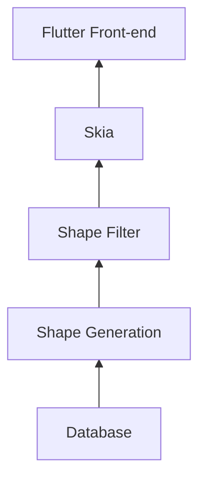

Layout Engine
=============

LEF/DEF layout view and editor with TCL interface.

Architecture
------------

1. The Database stores the raw layout data and is responsible for IO operations and object mutation.

2. The Shape Generation stage is a pipeline that converts the Database data into shapes based on generation options. For example, hierarchy depth or cell view selection i.e. abstract vs layout.

3. The Shape Filter stage is a pipeline that reduces the shapes based on the user viewport and layer visibility selections. Any out-of-scene shapes are removed and any hidden layers are removed.

4. Skia is then used to render the shapes provided by the Shape Filter to create a byte-stream.

5. Flutter uses a Texture to display the byte-stream to the user.

Project Organization
--------------------

* **backend** - contains the C++ code from Database to Skia
* **backend_plugin** - the dart interface between the backend and Flutter
* **fontend** - the user interface

Backend overview
----------------

